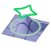
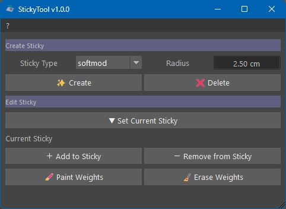

# StickyTool



**StickyTool for Maya 2025+ (Python 3.11+ and PySide6)**

- Create "Sticky Deformer", deformers remaining stuck to a deforming mesh
- Deformers can be either softmod (default) or cluster
- deformers are paintable



### UI features

- Hold mouse cursor over widgets to display tool tips<br/>
- Radius widget features presets with the right mouse button<br/>

## Installation

Copy the entire `stickyTool` directory to your `documents/maya/scripts`

This project was developed and tested with Maya 2025.<br/>
However, it should work in subsequent Maya versions or shipped with PySide6.

### Execution

In a python script tab or the python command line type or copy / paste and execute the following commands:

```python
import stickyTool.sticky_tool_UI as stk_ui
stk_ui.StickyToolUI()
```

This can be put in a shelf button.<br/>
The tool icon `stickyTool_64.png` can be found in the `icons` subdirectory.

## License

MIT License

Copyright (c) 2026 Michel 'Mitch' Pecqueur

Permission is hereby granted, free of charge, to any person obtaining a copy of this software and associated
documentation files (the "Software"), to deal in the Software without restriction, including without limitation the
rights to use, copy, modify, merge, publish, distribute, sublicense, and/or sell copies of the Software, and to permit
persons to whom the Software is furnished to do so, subject to the following conditions:

The above copyright notice and this permission notice shall be included in all copies or substantial portions of the
Software.

THE SOFTWARE IS PROVIDED "AS IS", WITHOUT WARRANTY OF ANY KIND, EXPRESS OR IMPLIED, INCLUDING BUT NOT LIMITED TO THE
WARRANTIES OF MERCHANTABILITY, FITNESS FOR A PARTICULAR PURPOSE AND NONINFRINGEMENT. IN NO EVENT SHALL THE AUTHORS OR
COPYRIGHT HOLDERS BE LIABLE FOR ANY CLAIM, DAMAGES OR OTHER LIABILITY, WHETHER IN AN ACTION OF CONTRACT, TORT OR
OTHERWISE, ARISING FROM, OUT OF OR IN CONNECTION WITH THE SOFTWARE OR THE USE OR OTHER DEALINGS IN THE SOFTWARE.